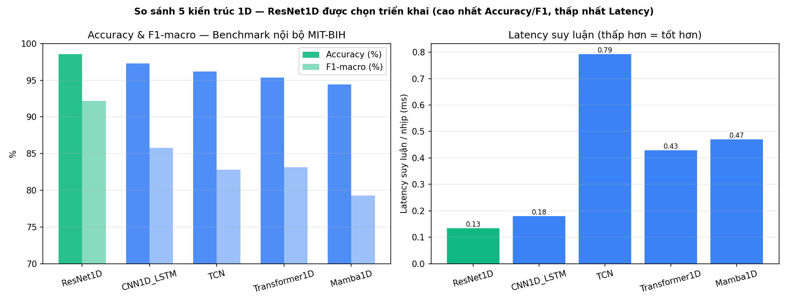
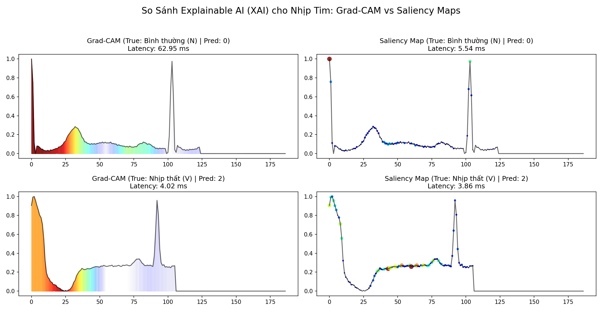
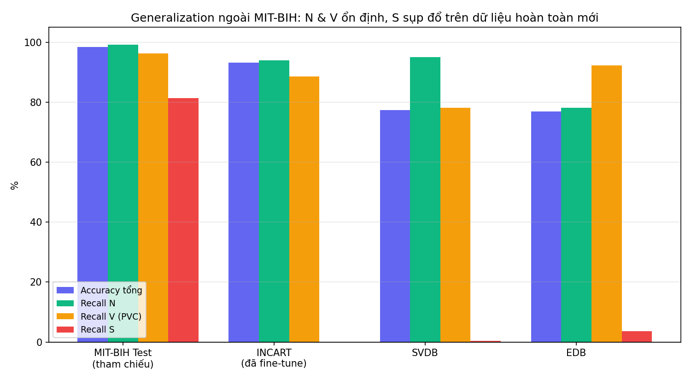

# Tổng Quan Hình Ảnh Kết Quả AI

Tập hợp toàn bộ biểu đồ/hình ảnh minh hoạ cho kết quả AI đã đạt được trong dự án — đi kèm giải
thích ngắn cho từng ảnh. Số liệu chi tiết + phân tích đầy đủ xem
[ai_process_summary.md](ai_process_summary.md); đây chỉ là phần **hình ảnh**, xem nhanh.

---

## 1. So sánh 5 kiến trúc Deep Learning — vì sao chọn ResNet1D

Benchmark cả 5 kiến trúc (ResNet1D, CNN1D_LSTM, TCN, Transformer1D, Mamba1D) trên cùng tập test
Kaggle MIT-BIH. **ResNet1D** thắng ở cả 2 tiêu chí quan trọng nhất: Accuracy/F1-macro cao nhất
**và** latency thấp nhất (0.13ms/nhịp) — quyết định chọn triển khai dựa trên bằng chứng, không
phải chọn tuỳ ý.

*Tái tạo*: `python -m backend.scripts.plot_ai_overview`

---

## 2. Sửa lỗi rò rỉ dữ liệu khi tách Validation

Bên trái: đường đỏ (tách Validation **sau** SMOTE — sai) leo lên tới 99.78%, cao hẳn so với
Test Accuracy thật của chính lần train đó (98.56%) — dấu hiệu rò rỉ dữ liệu rõ ràng. Đường xanh
(tách **trước** SMOTE — đã sửa) hội tụ sát đúng Test Accuracy của nó (98.51%), chênh chỉ 0.11
điểm % — bằng chứng model generalize thật, không học vẹt.

*Tái tạo*: `python -m backend.scripts.plot_c2_diagnostics`

---

## 3. Ma trận nhầm lẫn — đánh giá end-to-end trên dữ liệu PhysioNet thật

Chạy toàn bộ pipeline thật (tín hiệu thô → lọc nhiễu → Pan-Tompkins → model) trên 8 bản ghi
PhysioNet, so với nhãn bác sĩ. Accuracy tổng 96.62%. Đáng chú ý: lớp **V (Thất/PVC)** — quan
trọng nhất lâm sàng — đạt recall 96.5%; lớp **F (Hợp nhất)** chỉ 56.1% do bản chất hình dạng lai
giữa N và V, dễ nhầm ngay cả với bác sĩ.

*Tái tạo*: `python -m backend.scripts.plot_c2_diagnostics`

---

## 4. Explainable AI — Grad-CAM 1D chỉ ra vùng tín hiệu gây quyết định

Minh hoạ heatmap Grad-CAM 1D trên các nhịp bất thường — thay vì chỉ trả về nhãn "hộp đen", hệ
thống khoanh vùng chính xác đoạn sóng nào khiến model quyết định là bất thường, giúp bác sĩ đối
chiếu trực quan thay vì tin mù quáng vào AI.

---

## 5. Khả năng generalization ngoài MIT-BIH (INCART / SVDB / EDB)

So sánh Accuracy + Recall theo lớp trên 4 bộ dữ liệu hoàn toàn độc lập (khác bệnh viện/thiết
bị/đạo trình). **Tin tốt**: lớp N (xanh lá) và V/PVC (cam) ổn định 78-96% trên mọi bộ — model
không chỉ học vẹt MIT-BIH. **Tin cần nói thẳng**: lớp S (đỏ) sụp đổ gần như hoàn toàn trên SVDB
(0.4%) và EDB (3.6%) — đã thử 2 kỹ thuật fine-tune khác nhau để sửa nhưng đều thất bại (cải
thiện S luôn kéo theo hại V), nguyên nhân là giới hạn hình học của bài toán phân loại 5 lớp
dùng chung 1 mặt quyết định — ghi nhận là giới hạn đã biết, không tô hồng.

*Tái tạo*: `python -m backend.scripts.plot_ai_overview`

---

## Tổng hợp file ảnh

| File | Sinh bởi |
|---|---|
| `ai_benchmark_5_models.png` | `backend/scripts/plot_ai_overview.py` |
| `ai_generalization_datasets.png` | `backend/scripts/plot_ai_overview.py` |
| `c2_validation_leak_comparison.png` | `backend/scripts/plot_c2_diagnostics.py` |
| `c2_confusion_matrix.png` | `backend/scripts/plot_c2_diagnostics.py` |
| `xai_comparison.png` | `src/xai/test_xai.py` |
