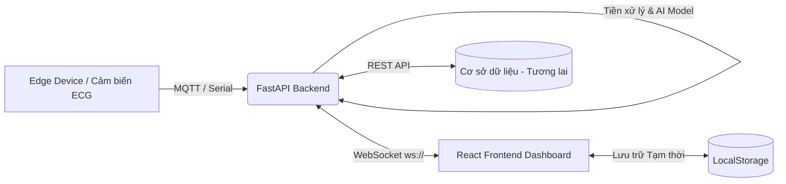

# Kiến Trúc Hệ Thống (System Architecture)
Dự án **ECG-Arrhythmia-Detection** (Hệ thống theo dõi nhịp tim & phát hiện bất thường thời gian thực).

## 1. Tổng quan Kiến trúc (High-Level Architecture)

Hệ thống được thiết kế theo mô hình **Client-Server** với giao tiếp **Real-time (WebSocket)** nhằm đảm bảo độ trễ thấp nhất trong y tế.

## 2. Các Thành Phần Chính

### 2.1. Frontend (React + Vite)
Đóng vai trò là **Dashboard Giám Sát**, được tổ chức theo chuẩn Modular (Enterprise UI):
- **Giao diện & Biểu đồ**: Sử dụng thư viện `react-plotly.js` tối ưu hóa để vẽ dữ liệu thời gian thực (10Hz).
- **Explainable AI (XAI)**: Tự động highlight (vùng đỏ) các điểm bất thường do AI trả về trực tiếp trên biểu đồ.
- **Trạng thái & Phục hồi (Resilience)**:
  - Tự động hiển thị `LoadingSpinner` thông minh.
  - Tự động kết nối lại (Auto-Reconnect) sau mỗi 3 giây nếu rớt mạng.
  - Sử dụng `LocalStorage` cho Patient Profile để đảm bảo không mất dữ liệu khi Refresh (F5).

### 2.2. Backend (Python + FastAPI)
Đóng vai trò là **Core Engine** xử lý luồng dữ liệu và Inference (Dự đoán):
- **Cấu trúc thư mục**:
  - `backend/api`: Quản lý các endpoint (ví dụ: `ws_routes.py` chứa logic WebSocket).
  - `backend/service`: Xử lý luồng dữ liệu (`data_streamer.py` đọc file dữ liệu mẫu/thiết bị thật).
  - `backend/core`: Quản lý cấu hình chung (CORS, Settings).
- **Giao tiếp**: Thiết lập kênh truyền WebSocket hai chiều (Bi-directional) truyền tải mảng JSON chứa `value`, `prediction`, và `latency`.

### 2.3. Trí tuệ nhân tạo (AI Model - Sắp tới)
Sẽ được tích hợp nguyên khối vào Backend (hoặc tách service riêng):
- Có nhiệm vụ tiền xử lý tín hiệu (loại bỏ nhiễu cơ, nhiễu điện từ).
- Chạy mô hình Học sâu (Deep Learning - 1D CNN / RNN) để phân loại nhịp tim bình thường hoặc các dạng bất thường (PVC, PAC, v.v.).

## 3. Luồng dữ liệu (Data Flow)

1. Backend mô phỏng hoặc nhận tín hiệu từ cảm biến với tần số nhất định (VD: 100ms/điểm).
2. Tín hiệu đi qua luồng AI Model để lấy kết quả phân tích (Ví dụ: `BÌNH THƯỜNG` hoặc `CẢNH BÁO PVC`).
3. Payload JSON được đẩy qua WebSocket tới Frontend.
4. Frontend cập nhật mảng State (bảo lưu 150 điểm gần nhất), vẽ lại Plotly, kiểm tra trạng thái Cảnh báo để tạo Event Log và Highlight dải sóng XAI.
