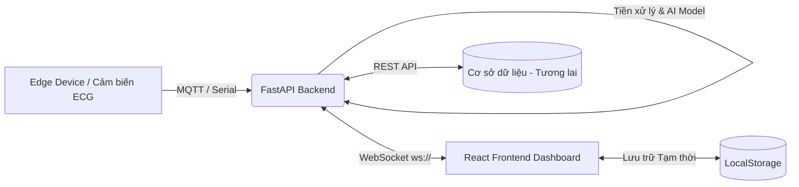

# Kiến Trúc Hệ Thống (System Architecture)
Dự án **ECG-Arrhythmia-Detection** (Hệ thống theo dõi nhịp tim & phát hiện bất thường thời gian thực).

## 1. Tổng quan Kiến trúc (High-Level Architecture)

Hệ thống được thiết kế theo mô hình **Client-Server** với giao tiếp **Real-time (WebSocket)** nhằm đảm bảo độ trễ thấp nhất trong y tế.

## 2. Các Thành Phần Chính

### 2.1. Frontend (React + Vite)
Đóng vai trò là **Dashboard Giám Sát**, được tổ chức theo chuẩn Modular (Enterprise UI):
- **Giao diện & Biểu đồ**: Sử dụng thư viện `react-plotly.js` tối ưu hóa để vẽ dữ liệu thời gian thực (10Hz).
- **Explainable AI (XAI)**: Tự động highlight (vùng đỏ) các điểm bất thường do AI trả về trực tiếp trên biểu đồ.
- **Trạng thái & Phục hồi (Resilience)**:
  - Tự động hiển thị `LoadingSpinner` thông minh.
  - Tự động kết nối lại (Auto-Reconnect) sau mỗi 3 giây nếu rớt mạng.
  - Sử dụng `LocalStorage` cho Patient Profile để đảm bảo không mất dữ liệu khi Refresh (F5).

### 2.2. Backend (Python + FastAPI)
Đóng vai trò là **Core Engine** xử lý luồng dữ liệu và Inference (Dự đoán):
- **Cấu trúc thư mục**:
  - `backend/api`: Quản lý các endpoint (ví dụ: `ws_routes.py` chứa logic WebSocket).
  - `backend/service`: Xử lý luồng dữ liệu (`data_streamer.py` đọc file dữ liệu mẫu/thiết bị thật) và inference (`inference_service.py`, singleton nạp `ResNet1D` + Grad-CAM).
  - `backend/core`: Quản lý cấu hình chung (CORS, Settings) và tiền xử lý tín hiệu số (`signal_processing.py`: bandpass filter, notch filter, chuẩn hoá biên độ).
- **Giao tiếp**: Thiết lập kênh truyền WebSocket hai chiều (Bi-directional) truyền tải mảng JSON chứa `chunk`, `prediction`, `heatmap`, và `latency_ms`.

### 2.3. Trí tuệ nhân tạo (AI Model)
Đã tích hợp trực tiếp vào Backend qua `ECGInferenceService` (singleton, nạp 1 lần khi khởi động):
- Mỗi cửa sổ 187 điểm nhận từ `data_streamer` được lọc bandpass (0.5–45Hz) + notch (50Hz) rồi chuẩn hoá biên độ về [0, 1] (`backend/core/signal_processing.py`) trước khi đưa vào model — bắt buộc vì model được train trên dữ liệu Kaggle MIT-BIH đã ở cùng miền chuẩn hoá này.
- Chạy `ResNet1D` (chọn theo benchmark, xem [benchmark_results.md](benchmark_results.md)) để phân loại 5 lớp AAMI (N/S/V/F/Q).
- Nếu phát hiện bất thường (lớp ≠ N), chạy thêm 1D Grad-CAM (`src/xai/gradcam1d.py`) để sinh heatmap giải thích.

## 3. Luồng dữ liệu (Data Flow)

1. Backend mô phỏng đọc tín hiệu ECG thật (MIT-BIH PhysioNet, 360Hz) qua `data_streamer.py`, gửi từng gói 10 điểm ở tốc độ 36 FPS.
2. Cửa sổ 187 điểm gần nhất được lọc nhiễu + chuẩn hoá rồi đưa qua `ECGInferenceService` để lấy kết quả phân tích (Ví dụ: `BÌNH THƯỜNG` hoặc `CẢNH BÁO: NHỊP THẤT (V)`) và heatmap XAI nếu có bất thường.
3. Payload JSON được đẩy qua WebSocket tới Frontend.
4. Frontend cập nhật mảng State (bảo lưu 1000 điểm gần nhất), vẽ lại Plotly, kiểm tra trạng thái Cảnh báo để tạo Event Log (`AnomalyContext`) và Highlight dải sóng XAI.
