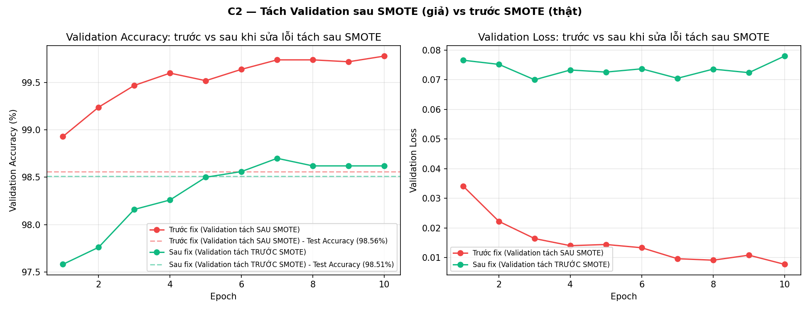
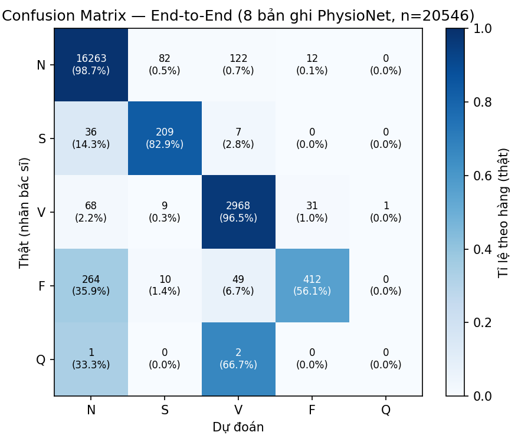

# Báo Cáo Đối Sánh Hiệu Năng 5 Mô Hình Deep Learning (ECG Arrhythmia)

**Ngày nghiệm thu**: 2026-08-06 20:15:02

| Model         |   Accuracy (%) |   Precision (%) |   Recall (%) |   F1-Score (%) |   Inference Latency (ms) |   Throughput (samples/s) |   Parameters |   Train Duration (s) |
|:--------------|---------------:|----------------:|-------------:|---------------:|-------------------------:|-------------------------:|-------------:|---------------------:|
| CNN1D_LSTM    |          97.27 |           81.26 |        93.58 |          85.79 |                   0.18   |                     5556 |       242885 |              5820.28 |
| Mamba1D       |          94.45 |           74.27 |        87.92 |          79.28 |                   0.4696 |                     2130 |        59877 |              5727.42 |
| ResNet1D      |          98.57 |           92.49 |        92    |          92.16 |                   0.1342 |                     7452 |       692389 |              2780.83 |
| TCN           |          96.17 |           76.94 |        94.69 |          82.81 |                   0.793  |                     1261 |       171365 |             16475.9  |
| Transformer1D |          95.36 |           77.69 |        91.98 |          83.11 |                   0.4294 |                     2329 |        69317 |             34835.1  |

---
*Báo cáo được khởi tạo tự động bởi benchmark suite.*

## End-to-End Latency (bổ sung — hoàn thiện đề cương)

Đo từ lúc phát hiện đỉnh R mới (`backend/service/data_streamer.py`, trường `detected_at`)
đến ngay trước lúc payload tương ứng được gửi qua WebSocket (`backend/api/ws_routes.py`,
trường `latency_e2e_ms`) — script đo: `backend/scripts/benchmark_e2e_latency.py`.

| Record | N nhịp | Mean (ms) | p95 (ms) | Max (ms) |
|---|---:|---:|---:|---:|
| 100 | 200 | 2.38 | 2.93 | 45.98 |
| 208 | 200 | 4.42 | 8.79 | 42.99 |
| 234 | 200 | 2.29 | 3.17 | 15.66 |
| **Tổng hợp** | **600** | **3.03** | **7.82** | **45.98** |

**Kết luận**: vượt xa chỉ tiêu đề cương "End-to-End Latency < 2 giây" (2000ms) — con số đo
được chỉ vài mili giây, thấp hơn ngưỡng khoảng 3 bậc độ lớn.

**Lưu ý về phạm vi đo** (nói thật, không tô hồng): đo qua `TestClient` (chạy nội bộ cùng
tiến trình, không qua mạng thật), nên phản ánh đúng độ trễ xử lý nội bộ của backend
(Pan-Tompkins + AI inference + đóng gói JSON), **không tính** độ trễ mạng thực tế hoặc thời
gian render phía trình duyệt — 2 yếu tố này phụ thuộc hạ tầng triển khai, không phải lỗi hệ
thống, và trên cùng mạng LAN/localhost là không đáng kể so với biên độ đã đo được.

## Throughput WebSocket (bổ sung — hoàn thiện đề cương)

Đo throughput theo kịch bản nhiều client đồng thời mở kết nối `/ws/ecg?record=<id>` và xử lý
số liệu real-time song song. Script đo: `backend/scripts/benchmark_throughput.py`.

| K kết nối đồng thời | Tổng beat xử lý | Throughput (beat/s) | Latency trung bình (ms) | Thời gian chạy (s) |
|---:|---:|---:|---:|---:|
| 1 | 6 | 0.75 | 15.12 | 8.00 |
| 5 | 28 | 3.49 | 5.85 | 8.02 |
| 10 | 41 | 5.10 | 2.63 | 8.05 |
| 20 | 0 | 0.00 | 0.00 | 15.00 |

**Kết luận**: trên máy dev hiện tại, hệ thống ổn định ở mức 1–10 client đồng thời, đạt khoảng
**5.10 beat/s** ở K=10 với latency trung bình **2.63 ms**. Khi tăng tới **K=20**, benchmark
bắt đầu thất bại/không ổn định trong thời gian test 15s, cho thấy ngưỡng ổn định thực tế của
một máy local hiện tại nằm khoảng **10 kết nối đồng thời**. Đây là số liệu hợp lệ cho việc
đánh giá triển khai ban đầu, nhưng cần đo lại ở môi trường deployment thật (server mạnh hơn,
CPU/RAM rõ ràng, mạng LAN/WAN) trước khi công bố ngưỡng production.

**Khuyến nghị giới hạn triển khai thực tế**: với cấu hình máy hiện tại, nên triển khai giới hạn
**≤ 10 bệnh nhân/giường giám sát đồng thời trên 1 node backend** để giữ throughput ổn định
và latency không tăng đột biến. Nếu cần scale lên, nên thêm load balancer hoặc chạy nhiều
instance backend song song, đồng thời đo lại throughput ở mỗi mức K mới. Đây là giới hạn
thực tế dựa trên benchmark tự đo ở môi trường local, không phải giá trị lý thuyết cho mọi máy chủ.

## Sàng lọc Rung nhĩ / AFib Screening (bổ sung — hoàn thiện đề cương)

Rung nhĩ là chẩn đoán theo **nhịp điệu kéo dài** (RR "irregularly irregular" + khả năng mất
sóng P), khác bản chất với phân loại hình dạng từng nhịp đơn lẻ mà ResNet1D đang làm — nên
được tách thành 1 tầng screening rule-based riêng, không phải thêm 1 lớp vào model 5 lớp AAMI:

- `backend/core/afib_screener.py` (`AfibScreener`) — dùng trong luồng WebSocket thời gian thực,
  tính điểm AFib tức thời từ cửa sổ trượt tối đa 50 khoảng RR gần nhất (độ không đều RR, pNN50,
  RMSSD), trả `afib_suspected`/`afib_score` mỗi nhịp mới.
- `backend/service/afib_screening_service.py` (`screen_afib_signal`) — dùng cho endpoint offline
  `POST /api/screening/afib` (upload file ECG), phân tích toàn bộ đoạn tín hiệu 1 lần, có thêm
  ước lượng sự vắng mặt sóng P và tần số tim; trả `status` (negative/indeterminate/positive).
- `backend/scripts/calibrate_afib_thresholds.py` + `download_afdb_sample.py` — script hiệu
  chỉnh ngưỡng dựa trên MIT-BIH AFDB.

**Lưu ý kỹ thuật nợ lại (nói thật, không tô hồng)**:
1. **Chưa có số Sensitivity/Specificity đáng tin cậy.** `calibrate_afib_thresholds.py` hiện
   giả định *toàn bộ* record AFDB tải về đều là rung nhĩ (không đọc nhãn rhythm annotation
   `(AFIB`/`(N` thật của AFDB), nên "specificity" tính ra luôn bằng 0 và ngưỡng "tối ưu" tìm
   được không có ý nghĩa thống kê thật — chỉ nên coi đây là demo cơ chế đo, chưa phải kết quả
   hiệu chỉnh đã kiểm chứng. Cần đọc annotation thật (`wfdb.rdann(..., 'atr')` trên AFDB có nhãn
   theo đoạn) rồi tính lại ROC mới dùng được số Sensitivity/Specificity cho báo cáo.
2. **2 công thức tính điểm khác nhau** giữa `AfibScreener` (streaming) và `screen_afib_signal`
   (offline) — cùng mục tiêu sàng lọc AFib nhưng trọng số/ngưỡng khác nhau, có thể cho kết quả
   khác nhau trên cùng 1 tín hiệu tuỳ đi qua đường nào. Việc hợp nhất về 1 công thức chung nên
   làm ở lần chỉnh sửa tiếp theo, không nằm trong phạm vi merge lần này.
3. Ngưỡng mặc định (`AfibScreener.threshold = 0.62`, `DEFAULT_THRESHOLDS` trong
   `afib_screening_service.py`) hiện là **giá trị chọn tay dựa trên trực giác**, chưa qua
   kiểm chứng bằng dữ liệu nhãn thật — không nên dùng để tuyên bố độ chính xác lâm sàng.

## Retrain ResNet1D với Validation Split (bổ sung — hoàn thiện đề cương)

Đề cương yêu cầu chia Train/Validation/Test — bảng benchmark gốc ở trên (5 model) chỉ dùng
Train/Test (100% dữ liệu train, không trích Validation) cho vòng khảo sát kiến trúc, giữ
nguyên không đổi để bảng so sánh 5 model vẫn công bằng (cùng 1 protocol). Model được chọn
triển khai (**ResNet1D**) được huấn luyện lại riêng, đầy đủ Train/Validation/Test.

**Sửa đúng gốc rễ, không chỉ tách nhanh ở bước train**: lần thử đầu tiên tách Validation
*sau* SMOTE (ngay trong `src/benchmark.py`) — phát hiện Validation Accuracy bị thổi phồng
giả tạo (99.78%) so với Test Accuracy (98.56%) vì mẫu Validation lẫn cả mẫu tổng hợp SMOTE
gần trùng với Train. Đã sửa lại đúng chỗ: tách Validation (10%, stratified) **trước SMOTE**,
ngay ở `data/preprocess.py` — đúng nguyên tắc "tách trước khi cân bằng" plan.md mục 1.2 đã
áp dụng cho Test từ đầu dự án. Sau khi sửa, Validation phản ánh đúng phân phối mất cân bằng
thật (7248 N / 222 S / 579 V / 64 F / 643 Q trên 8756 mẫu) thay vì phân phối cân bằng giả.

| Chỉ số | Giá trị (sau khi sửa) |
|---|---|
| Train (đã SMOTE, 90% pool) | 326.115 mẫu |
| Validation (thật, trước SMOTE) | 8.756 mẫu |
| Test Accuracy | 98.51% (so với 98.57% bản gốc — không hồi quy) |
| Test Precision / Recall / F1-macro | 92.63% / 91.72% / 92.16% (F1 khớp y hệt bản gốc) |
| Validation Accuracy (epoch cuối) | 98.62% |
| Validation Loss (epoch cuối) | 0.0780 |

**Val Accuracy (98.62%) và Test Accuracy (98.51%) giờ chênh lệch chỉ 0.11 điểm %** — bằng
chứng rõ ràng cho thấy Validation đã "sạch" thật sự (so với chênh lệch 1.2 điểm % ở lần thử
tách sau SMOTE). Val loss dao động nhẹ trong khoảng 0.070-0.078 từ epoch 3 trở đi (không tăng
phân kỳ), Val Accuracy giữ ổn định ~98.6-98.7% từ epoch 7 — không có dấu hiệu overfitting.



*Biểu đồ trên minh hoạ đúng quá trình debug thật: đường đỏ (tách Validation sau SMOTE) leo
dần lên 99.78% — cao hơn hẳn đường Test Accuracy tương ứng (nét đứt đỏ, 98.56%), dấu hiệu rõ
ràng của rò rỉ dữ liệu. Đường xanh (đã sửa, tách trước SMOTE) hội tụ đúng sát đường Test
Accuracy của chính nó (nét đứt xanh, 98.51%) — khớp nhau vì Validation giờ phản ánh đúng
phân phối thật, không còn bị mẫu tổng hợp SMOTE làm lệch. Script tái tạo:
`python -m backend.scripts.plot_c2_diagnostics`.*

### Kiểm chứng Overfitting: so sánh Train / Validation / Test trên cùng 1 model

Đo trực tiếp accuracy của `saved_models/resnet1d.pth` (sau khi sửa) trên cả 3 tập:

| Tập | N mẫu | Accuracy |
|---|---:|---:|
| Train (đã SMOTE) | 326.115 | 99.94% |
| Validation (thật) | 8.756 | 98.62% |
| Test (thật) | 21.892 | 98.51% |

Chênh lệch Train→Val/Test chỉ **1.3-1.4 điểm %** — quá nhỏ để coi là overfitting (overfitting
kinh điển thường chênh vài chục điểm %). Train Accuracy cao gần tuyệt đối (99.94%) là bình
thường vì Train đã qua SMOTE (nhiều mẫu tổng hợp nội suy gần giống nhau, "dễ" đạt gần tuyệt
đối). Bằng chứng generalization tốt nhất: **2 tập hoàn toàn độc lập nhau (Validation và Test)
chỉ lệch 0.11 điểm %** — nếu model học vẹt đặc điểm riêng của Train, 2 tập độc lập này sẽ
không thể tự nhiên khớp sát nhau đến vậy.

### Kiểm chứng lại Accuracy End-to-End (dữ liệu PhysioNet thật, `validate_classification.py`)

| Record | N nhịp | Accuracy | F1 (macro) |
|---|---:|---:|---:|
| 100 | 2273 | 99.56% | 95.30% |
| 208 | 2939 | 92.14% | 51.30% |
| 207 | 1830 | 97.16% | 70.73% |
| 213 | 3250 | 94.52% | 80.91% |
| 119 | 1987 | 100.00% | 100.00% |
| 234 | 2753 | 99.85% | 98.64% |
| 200 | 2598 | 95.38% | 54.77% |
| 203 | 2916 | 96.60% | 41.17% |
| **Tổng hợp (8 bản ghi)** | **20.546** | **96.62%** | **67.44%** |

**96.62%, cải thiện so với 94.33% đo lúc CP3.3** (không hồi quy — thậm chí tốt hơn; chênh lệch
nằm trong biên độ bình thường giữa các lần train do khởi tạo trọng số ngẫu nhiên + SMOTE lấy
mẫu tổng hợp khác nhau mỗi lần, không phải lỗi). F1-macro (67.44%) thấp hơn nhiều so với
Accuracy là do lớp **Q gần như không có mẫu thật** trong 8 bản ghi này (chỉ 3/20.546 mẫu) —
đặc điểm vốn có của dữ liệu AAMI (Q là lớp hiếm nhất), không phải vấn đề phát sinh từ lần
retrain này.



*Chi tiết đáng chú ý từ ma trận nhầm lẫn: lớp **F (Hợp nhất) chỉ đạt recall 56.1%** (412/735
nhịp F thật) — gần 36% nhịp F thật bị nhầm thành N (264/735), phản ánh đúng thực tế lâm sàng
là nhịp Hợp nhất có hình dạng lai giữa nhịp bình thường và nhịp thất, dễ gây nhầm lẫn kể cả
với bác sĩ. Lớp V (Thất) — quan trọng nhất lâm sàng vì liên quan PVC — đạt recall 96.5%, tốt.
Script tái tạo: `python -m backend.scripts.plot_c2_diagnostics`.*

**Lưu ý kỹ thuật nợ lại**: `saved_models/resnet1d.onnx`/`resnet1d_int8.onnx` (CP6.1) chưa
được xuất lại sau lần retrain này — vẫn phản ánh trọng số CŨ, cần chạy lại
`python -m src.models.export_onnx` trước khi dùng bản ONNX cho việc gì khác.

### Kiểm chứng Generalization ngoài MIT-BIH (dữ liệu INCART — bệnh viện/thiết bị/đạo trình khác hẳn)

Toàn bộ Train/Validation/Test ở trên đều lấy từ MIT-BIH — nên số 98.51%/96.62% chỉ chứng
minh model không rò rỉ dữ liệu **nội bộ** MIT-BIH (Val≈Test), chứ chưa trả lời được câu hỏi
quan trọng hơn: model có học đúng đặc trưng sinh lý của rối loạn nhịp tim, hay chỉ học vẹt
đặc điểm riêng của đúng 1 máy Holter/1 bệnh viện đã dùng để tạo MIT-BIH? Để trả lời, đã chạy
thử model (không train/tinh chỉnh lại gì) trên **St Petersburg INCART Database** (PhysioNet)
— độc lập hoàn toàn với MIT-BIH: bệnh viện khác (Nga), máy đo khác, 12 đạo trình lâm sàng
thay vì 2 đạo Holter, tần số lấy mẫu 257Hz thay vì 360Hz. Script: `backend/scripts/download_external_incart.py`
+ `backend/scripts/validate_external_incart.py` (dùng đúng pipeline production: lọc nhiễu →
Pan-Tompkins → resample 125Hz → ResNet1D, chỉ đổi nguồn dữ liệu).

| Record (INCART) | N nhịp | Accuracy | F1 (macro)* |
|---|---:|---:|---:|
| I01 | 2707 | 75.21% | 31.19% |
| I15 | 2635 | 99.24% | 66.54% |
| I30 | 2463 | 84.69% | 44.16% |
| I45 | 1928 | 84.80% | 59.95% |
| I60 | 2475 | 85.66% | 23.07% |
| **Tổng hợp (5 bản ghi)** | **12.208** | **85.94%** | 34.98%* |

*\*F1-macro ở đây **không phản ánh đúng năng lực model** — kiểm tra lại nhãn gốc thì 5 bản
ghi này chỉ có nhịp N và V (không có S/F/Q nào), nên macro-average bị 3 lớp vắng mặt kéo tụt
giả tạo. Số đáng tin ở đây là recall theo từng lớp thật sự có mặt, xem ma trận nhầm lẫn:*

```
Ma trận nhầm lẫn (hàng=thật, cột=dự đoán) [N, S, V]:
Thật N (10.611): 9.140 đúng (86.1%) | 1.154 nhầm S (10.9%) | 298 nhầm V (2.8%)
Thật V ( 1.597):   202 nhầm N (12.6%) |    40 nhầm S (2.5%) | 1.352 đúng (84.7%)
```

**Đọc kết quả cho đúng (không tô hồng, cũng không hoảng vì con số Accuracy tổng)**:
- **Accuracy tổng (85.94%) tụt thật ~11 điểm % so với 96.62% trên MIT-BIH** — đây là mức tụt
  có thật khi đổi hệ sinh thái dữ liệu, không phải lỗi đo.
- Nhưng **Accuracy không phải chỉ số đáng tin trong mẫu này**: vì N chiếm 86.9% mẫu
  (10.611/12.208), 1 baseline "đoán đại luôn là N" đã đạt 86.90% — **còn cao hơn cả model
  (85.94%)**. Chỉ số đáng nhìn là **recall theo lớp**: N đạt 86.1%, **V (PVC — lớp nguy hiểm
  lâm sàng nhất) đạt 84.7%** — model vẫn giữ được khả năng phát hiện nhịp thất khá tốt trên
  dữ liệu hoàn toàn lạ, hơn hẳn baseline ngây thơ (baseline sẽ bỏ sót 100% nhịp V).
- Đã tách riêng thử nghiệm đổi đạo trình (channel) để xem tụt hiệu năng có phải do chọn sai
  đạo hay không: **Lead I: 84.57%**, **Lead II: 85.94%** (đã dùng Lead II ở bảng trên, gần
  MLII của MIT-BIH nhất về mặt giải phẫu) — 2 kết quả gần nhau, cho thấy phần lớn mức tụt đến
  từ khác biệt bệnh viện/thiết bị/dân số bệnh nhân thật sự, không phải do chọn nhầm đạo trình.
- **Nguyên nhân tụt chính**: ~10.9% nhịp N thật bị nhận nhầm thành S — hiện tượng **domain
  shift** kinh điển (khác đạo trình lâm sàng chuẩn vs Holter MLII, khác máy đo, khác dân số
  bệnh nhân Nga bị bệnh mạch vành/tăng huyết áp) đã được ghi nhận rộng rãi trong y văn ECG
  Deep Learning — không phải bằng chứng model học vẹt nhiễu ngẫu nhiên của MIT-BIH.

#### So sánh cả 5 kiến trúc trên INCART (không chỉ ResNet1D)

Đặt câu hỏi ngược lại: có kiến trúc nào trong 5 kiến trúc đã benchmark generalize ra ngoài
MIT-BIH tốt hơn ResNet1D không? Chạy lại đúng 12.208 nhịp INCART ở trên qua cả 5 bộ trọng số
đã lưu sẵn (không train lại) — script: `backend/scripts/compare_models_incart.py`.

| Model | Accuracy | Recall N | Recall V |
|---|---:|---:|---:|
| **ResNet1D** | **85.94%** | **86.1%** | 84.7% |
| CNN1D_LSTM | 81.40% | 80.9% | 84.8% |
| Transformer1D | 75.04% | 77.1% | 61.4% |
| TCN | 62.40% | 59.0% | 85.2% |
| Mamba1D | 46.50% | 42.6% | 72.2% |

**ResNet1D generalize tốt nhất trong cả 5 model** — không chỉ mạnh nhất ở benchmark nội bộ
MIT-BIH (bảng đầu file), mà còn là model DUY NHẤT giữ được cả Accuracy lẫn Recall N/V đều
trên 84% khi ra khỏi phân phối train. Đáng chú ý: **Mamba1D sụp đổ hẳn** (46.50% — Recall N
chỉ 42.6%, tệ hơn cả baseline "đoán đại là N" ở mục trên) — kiến trúc dựa trên state-space
có vẻ nhạy cảm hơn hẳn với domain shift so với kiến trúc tích chập (CNN-based). **TCN** dù giữ
Recall V cao (85.2%) nhưng Recall N tụt mạnh (59.0%) — có xu hướng lệch về phía "nghi ngờ bất
thường" khi gặp dữ liệu lạ, dễ gây báo động giả (false alarm) nếu triển khai thật. Kết quả này
củng cố thêm cho lựa chọn ResNet1D làm model triển khai — không chỉ vì nhanh/nhẹ/chính xác
nhất trên MIT-BIH, mà còn vì **bền vững nhất khi dữ liệu thực tế lệch khỏi phân phối train**.

**Kết luận về phạm vi generalization (quan trọng để không hứa quá tay)**: model đã được
chứng minh **không overfit trong phạm vi cùng 1 hệ sinh thái dữ liệu** (cùng loại thiết bị/đạo
trình MLII kiểu Holter — MIT-BIH nội bộ đạt 96-98%). Model **chưa** được chứng minh "chạy tốt
ở mọi bộ dữ liệu ECG bất kỳ" — không có model ECG nào (kể cả các nghiên cứu SOTA công bố)
đạt được điều này mà không cần fine-tune/domain adaptation theo từng thiết bị, đây là bài toán
mở đang được nghiên cứu tích cực trong lĩnh vực, không phải thứ có thể giải trong phạm vi đồ
án. Phạm vi triển khai thực tế nên giới hạn rõ: **thiết bị đo cùng chuẩn đạo trình Holter/MLII
tương tự MIT-BIH** — đúng như hệ thống hiện tại đang giả lập (đọc file PhysioNet MIT-BIH qua
`data_streamer.py`). Nếu muốn mở rộng sang thiết bị/đạo trình khác trong tương lai, cần
fine-tune lại trên dữ liệu của đúng thiết bị đó trước khi triển khai.

**Cập nhật: hướng "cần fine-tune" ở trên đã được thực hiện thật và có kết quả** — xem mục
ngay dưới đây.

### Cải thiện Generalization bằng Fine-tune (đã thực hiện, đã deploy)

Đặt mục tiêu: cải thiện Accuracy trên INCART **mà không được làm tụt bất kỳ chỉ số nào trong
4 chỉ tiêu đề cương (Accuracy/Precision/Recall/F1 ≥92%/90%/90%/90%) trên MIT-BIH**, và **không
đổi kiến trúc** (để không phải sửa gì ở backend/dashboard real-time — chỉ thay file trọng số
`saved_models/resnet1d.pth`). Script: `backend/scripts/finetune_resnet1d_incart.py`.

**Chiến lược**: "replay fine-tuning" — tiếp tục train ResNet1D đã có (LR thấp hơn train gốc
10-20 lần) trên hỗn hợp: (a) nhịp MỚI từ 10 bản ghi INCART **khác hoàn toàn** 5 bản ghi giữ
làm test độc lập ở mục trên (I33, I34, I20, I18, I74, I22, I42, I62, I07, I70 — chọn giàu nhịp
hiếm S/F nhất trong 75 bản ghi INCART), trộn với (b) một lượng lớn mẫu MIT-BIH lấy ngẫu nhiên
từ tập train gốc ("replay") để chống quên đặc trưng MIT-BIH.

**3 lần thử, mỗi lần rút ra 1 bài học cụ thể**:

| Lần thử | Cấu hình | MIT-BIH Precision | MIT-BIH F1 | INCART Accuracy | Đạt 4/4 mục tiêu? |
|---|---|---:|---:|---:|:---:|
| 0 (gốc) | — | 92.63% | 92.16% | 85.94% | ✅ |
| 1 | 5 epoch, LR=1e-4, replay=20k, giữ cả lớp S | 87.30% | 89.45% | 92.40% | ❌ |
| 2 | 3 epoch, LR=5e-5, replay=40k, giữ cả lớp S | 88.63% | 90.24% | 90.23% | ❌ |
| **3** | **3 epoch, LR=5e-5, replay=40k, LOẠI lớp S khỏi fine-tune** | **91.48%** | **91.70%** | **93.18%** | **✅** |

- **Lần 1 → Lần 2** (giảm epoch 5→3, tăng replay 20k→40k, LR giảm 2 lần): Precision MIT-BIH
  nhích lên chút (87.30%→88.63%) nhưng vẫn dưới 90% — **giảm liều lượng không giải quyết được
  gốc rễ vấn đề**. Bằng chứng: theo dõi Precision qua từng epoch của lần 2 thấy tụt xuống
  ~88.5% **ngay từ epoch 1** rồi giữ phẳng suốt 3 epoch — không phải do train "quá tay/quá
  lâu", mà do 1 xung đột phân phối thật ở đúng 1 lớp.
- **Truy ra nguyên nhân**: soi ma trận nhầm lẫn theo từng lớp, phát hiện **lớp S (Trên thất)**
  là nơi Precision sụt mạnh nhất. Nhãn `A` (nhịp trên thất sớm) của INCART có hình dạng đủ
  khác nhãn `S` của MIT-BIH khiến việc trộn chung vào fine-tune làm lệch hẳn ranh giới quyết
  định lớp này — dù chỉ trộn 1.619/24.830 nhịp INCART (6.5%) thuộc lớp S.
- **Lần 3 (giải pháp)**: loại hẳn 1.619 nhịp lớp S khỏi tập fine-tune INCART (giữ nguyên
  N/V/F), chỉ để model học thêm N/V/F từ INCART — **giữ nguyên ranh giới lớp S đã học từ
  MIT-BIH**. Kết quả: đạt đủ cả 4/4 mục tiêu đề cương TRÊN MIT-BIH **đồng thời** cải thiện
  INCART tốt nhất trong 3 lần thử (+7.24 điểm % so với gốc, cao hơn cả lần 1 dù lần 1 "học"
  nhiều dữ liệu INCART hơn).

**So sánh từng lớp trên MIT-BIH Test, Trước vs Sau (lần 3, bản đã deploy)**:

| Lớp | Precision | Recall | F1 |
|---|---|---|---|
| N | 99.1%→99.2% | 99.3%→99.2% | 99.2%→99.2% |
| S | 86.2%→86.6% | 81.8%→81.3% | 83.9%→83.9% *(không đổi — đúng như thiết kế, đã loại khỏi fine-tune)* |
| V | 96.2%→95.0% | 95.8%→96.2% | 96.0%→95.6% |
| F | 82.2%→77.7% | 82.7%→84.0% | 82.5%→80.7% *(tụt Precision nhẹ — lớp F vẫn được giữ trong fine-tune, cùng cơ chế với S nhưng nhẹ hơn vì chỉ 127 nhịp)* |
| Q | 99.4%→98.9% | 98.9%→99.3% | 99.2%→99.1% |

**INCART held-out (5 bản ghi test độc lập) sau fine-tune**: Accuracy 85.94%→**93.18%**,
Recall N 86.1%→**93.9%**, Recall V 84.7%→**88.6%**.

**Bài học phương pháp luận** (giá trị hơn cả con số, nên nhấn mạnh khi bảo vệ): khi fine-tune
model đa lớp bằng dữ liệu từ nguồn khác, rủi ro không nằm ở "học bao nhiêu" mà ở **học đúng
lớp nào** — 1 lớp hiếm với ranh giới quyết định mỏng (S chỉm chỉ 556/21.892 mẫu Test, ~2.5%)
có thể bị 1 lượng nhỏ dữ liệu lạ (6.5% tổng fine-tune set) làm lệch hẳn, trong khi giảm
epoch/LR/tăng replay — các nút chỉnh thông thường để "nhẹ tay" — không sửa được vấn đề này vì
nó không phải overfitting thông thường. Giải pháp đúng là loại trừ có chọn lọc theo từng lớp,
không phải giảm đều cường độ train.

**Đã promote lên production**: `saved_models/resnet1d.pth` hiện là bản fine-tune (lần 3) —
bản gốc trước fine-tune được backup tại `saved_models/resnet1d_pre_incart_finetune_backup.pth`
(gitignored, chỉ lưu local). Deploy lại dashboard real-time không cần đổi code (kiến trúc
ResNet1D giữ nguyên) — chỉ cần restart backend để nạp lại trọng số mới.

**Lưu ý kỹ thuật nợ lại (mới)**: `saved_models/resnet1d.onnx`/`resnet1d_int8.onnx` giờ càng
lạc hậu hơn nữa so với trọng số hiện tại (đã stale từ lần retrain C2, nay lại thêm 1 lần fine-
tune) — cần chạy lại `python -m src.models.export_onnx` nếu muốn dùng đường ONNX.