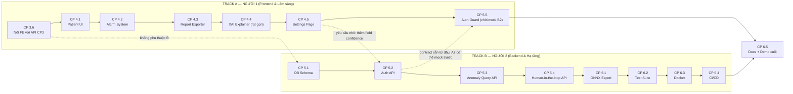

# PHÂN CÔNG CÔNG VIỆC (PCCV) — CHECKPOINT 3.6 → 6

> Điền tên/GitHub username thật vào 2 chỗ dưới đây trước khi bắt đầu:
> - **NGƯỜI 1 — Track A (Frontend & Lâm sàng)**: `____________`
> - **NGƯỜI 2 — Track B (Backend, Database & Hạ tầng)**: `____________`
>
> Tài liệu này chỉ nói **AI làm gì, theo thứ tự nào, cần báo gì cho người kia, và đang chờ gì**. Chi tiết kỹ thuật (file cụ thể, API contract, schema, DoD) đã có đầy đủ trong [plan.md](plan.md) — tài liệu này luôn dẫn lại đúng mục số của `plan.md`, không lặp lại toàn văn để tránh 2 file lệch nhau theo thời gian.
>
> **Cập nhật lần cuối**: 2026-08-30. Trạng thái nền: Checkpoint 1-3 (backend) đã xong trên `main`, xem `plan.md` mục I-III.3.

---

## 0. NGUYÊN TẮC LÀM VIỆC CHUNG

1. **Mỗi checkpoint nhỏ = 1 nhánh riêng**, đặt tên `feat/<cp-id>-<mo-ta-ngan>` (vd `feat/cp4.1-patient-ui`, `feat/cp5.1-db-schema`), tách từ `main` mới nhất. Xong 1 checkpoint nhỏ → mở PR vào `main`, người kia review nhanh (không bắt buộc block nhau lâu — dự án 2 người, review chủ yếu để biết người kia đang làm gì) → merge → báo trong nhóm chat.
2. **Không sửa file thuộc "vùng" của người kia** trừ khi đó là 1 trong các "Yêu cầu chéo track" đã ghi rõ trong `plan.md` (vd CP4.5 cần thêm `confidence` vào backend). Nếu phát sinh nhu cầu sửa chéo ngoài danh sách đó → nhắn hỏi trước, đừng tự sửa rồi báo sau.
   - Track A (Frontend) chỉ động vào: `frontend/**`, và **đọc** (không sửa) `plan.md`/`pccv.md`/`README.md`.
   - Track B (Backend) chỉ động vào: `backend/**`, `src/**`, `data/**`, `tests/**`, `.github/**`, `*.Dockerfile`, `docker-compose.yml`, `requirements.txt`.
3. **Đồng bộ 2 chiều diễn ra qua PR + báo trong nhóm chat, không qua họp**. Mỗi khi 1 sub-checkpoint xong, làm đúng 3 bước:
   - (a) Chạy đúng lệnh test/DoD ghi trong `plan.md` cho sub-checkpoint đó.
   - (b) Tick `[x]` vào đúng dòng sub-checkpoint trong `plan.md` (phần III) — **cả 2 người cùng sửa `plan.md` được, vì mỗi người chỉ tick dòng của mình, hiếm khi đụng nhau; nếu bị conflict lúc merge thì chỉ là conflict text, tự giải quyết được**.
   - (c) Đăng đúng "Nội dung cần báo" ghi trong mục checkpoint đó ở tài liệu này (mục 2/3 bên dưới) — để người kia biết interface/API đã sẵn sàng dùng.
4. **Không ai được block hoàn toàn bởi người kia** — mọi chỗ có phụ thuộc (mục 4 "Ma trận phụ thuộc") đều có sẵn cách "mock tạm" để làm song song, ghi rõ trong mục đó.
5. Trước khi bắt đầu 1 sub-checkpoint mới: `git checkout main && git pull` để chắc chắn nhánh mới tách từ bản mới nhất.

---

## 1. TỔNG QUAN 2 TRACK



**Vì sao chia thế này**: CP4 (Track A) và CP5+CP6 (Track B) **không đụng file của nhau** (Frontend thuần React vs Backend thuần Python/infra) nên gần như không có merge conflict. Chỉ có đúng **2 điểm nối** cần chú ý, cả 2 đều đã có cách làm song song không cần chờ (xem mục 4).

---

## 2. TRACK A — NGƯỜI 1: FRONTEND & LÂM SÀNG

Làm theo đúng thứ tự dưới đây (mỗi mục đã sắp theo phụ thuộc nội bộ trong track — không nhảy cóc để đỡ phải quay lại sửa).

### A1. CP 3.6 — Nối Frontend với API Checkpoint 3
- **Chi tiết kỹ thuật đầy đủ**: `plan.md` mục 3.6.
- **Không phụ thuộc ai** — 3 API (`GET /api/records`, WS đã có `bpm/hrv_sdnn/hrv_rmssd/is_new_beat`, `POST /api/diagnosis/upload-ecg`) đã chạy sẵn trên `main`. Chạy `uvicorn backend.main:app` là có đủ backend để làm và test ngay.
- **Việc cụ thể**: thêm ô BPM/HRV vào `StatCards.jsx`; component `RecordSelector.jsx` gọi `GET /api/records` + đổi query param WS; 1 form/modal upload CSV gọi API chẩn đoán offline.
- **✅ Khi xong, báo trong nhóm chat**: "CP3.6 xong — Dashboard giờ có BPM/HRV/chọn bản ghi/upload, PR #___". Không ảnh hưởng Track B, chỉ cần báo cho biết.
- **Test trước khi báo xong**: mở `npm run dev` + `uvicorn backend.main:app`, đổi bản ghi qua `100` (bình thường) và `208` (nhiều PVC), xác nhận số liệu đổi đúng theo mô tả ở `plan.md` mục 3.4.

### A2. CP 4.1 — Patient Management UI
- **Chi tiết kỹ thuật đầy đủ**: `plan.md` mục 4.2.
- **Phụ thuộc**: cần A1 (CP3.6) xong trước, vì bấm 1 bệnh nhân phải đổi đúng luồng stream (dùng lại cơ chế đổi `record` vừa làm ở A1).
- **✅ Khi xong, báo**: "CP4.1 xong — có `PatientContext`, data lưu `localStorage` key `ecg_patients`, PR #___". Ghi rõ tên key localStorage trong tin nhắn báo — sau này CP5 cần biết đúng key này để viết script di cư dữ liệu sang database thật (không phải việc của Track A, chỉ cần ghi lại để Track B biết).

### A3. CP 4.2 — Hệ thống Cảnh báo Đa Tầng
- **Chi tiết kỹ thuật đầy đủ**: `plan.md` mục 4.3 (kèm bảng phân cấp mức độ 🟢🟡🔴 — bảng này là **nguồn duy nhất**, đừng tự định nghĩa lại mức độ ở chỗ khác).
- **Không phụ thuộc gì mới** (chỉ cần A1 đã xong để có dữ liệu real-time chạy thử).
- **✅ Khi xong, báo**: "CP4.2 xong — âm thanh/mute/push notification hoạt động, PR #___".

### A4. CP 4.3 — Xuất Báo Cáo Y Tế (PDF/CSV)
- **Chi tiết kỹ thuật đầy đủ**: `plan.md` mục 4.4. Làm hoàn toàn Frontend (`jspdf` + `html2canvas`), không cần chờ backend.
- **✅ Khi xong, báo**: "CP4.3 xong — nút xuất PDF/CSV ở [vị trí], PR #___".

### A5. CP 4.4 — AI Diagnostic Explainer (bản rút gọn)
- **Chi tiết kỹ thuật đầy đủ + giới hạn phạm vi cố ý**: `plan.md` mục 4.5 — đọc kỹ phần "giới hạn phạm vi" trước khi làm, tránh làm lố sang đo PR/QRS/ST thật (không nằm trong CP4).
- **✅ Khi xong, báo**: "CP4.4 xong — bảng giải thích lâm sàng theo nhãn AAMI, PR #___".

### A6. CP 4.5 — Settings & Calibration Page
- **Chi tiết kỹ thuật đầy đủ**: `plan.md` mục 4.6.
- **✅ Yêu cầu chéo track #1 đã xong (2026-08-30)**: field `confidence` đã có sẵn trong payload WS (`data.confidence`, 0-1) — dùng thẳng được, không cần mock/chờ gì nữa.
- **✅ Khi xong, báo**: "CP4.5 xong — Settings Page hoạt động, ngưỡng nhạy AI đã áp dụng thật qua field `confidence`, PR #___".

### A7. CP 5.5 — Frontend Auth Guard & Role-based UI (ĐIỂM NỐI VỚI TRACK B)
- **Chi tiết kỹ thuật đầy đủ**: `plan.md` mục 5.6.
- **Cách làm KHÔNG bị block bởi Track B**: contract của `POST /api/auth/login` / `GET /api/auth/me` đã cố định sẵn trong `plan.md` mục 5.3 ngay từ đầu. Dựng `LoginPage.jsx` + `AuthContext.jsx` gọi thẳng vào URL thật (`/api/auth/login`...) nhưng **có thể tự chạy 1 server giả lập nhỏ** (vd `json-server` hoặc 1 file mock trả cứng đúng JSON theo contract) để test trước khi Track B xong CP5.2. Khi Track B báo CP5.2 xong (mục 3, B2), chỉ cần đổi base URL về backend thật — không phải sửa logic gì thêm nếu contract được tuân thủ đúng.
- **Chờ báo từ Track B**: "CP5.2 xong" (xem mục 3, B2) trước khi coi CP5.5 là **hoàn thành thật** (trước đó vẫn làm được với mock).
- **✅ Khi xong, báo**: "CP5.5 xong — đăng nhập/phân quyền hoạt động với backend thật, PR #___".

---

## 3. TRACK B — NGƯỜI 2: BACKEND, DATABASE & HẠ TẦNG

### B1. CP 5.1 — Database Schema & SQLAlchemy ORM — ✅ Hoàn thành 2026-08-30
- **Chi tiết kỹ thuật đầy đủ**: `plan.md` mục 5.2 (schema 5 bảng đầy đủ).
- **Không phụ thuộc gì** — làm được ngay song song với Track A từ ngày đầu tiên.
- **✅ Đã báo**: DB SQLite (`backend/db/ecg_system.db`, gitignore) + đủ 5 bảng (`users`, `patients`, `ecg_records`, `anomaly_events`, `audit_trails`) qua SQLAlchemy 2.0 + Alembic. `alembic upgrade head`/`downgrade base` đã kiểm chứng cả 2 chiều. `python -m backend.scripts.validate_db` chạy xanh (insert/query/relationship 2 chiều đúng). Ai cần dùng DB (B2, B3, B4) chỉ cần: `from backend.db.session import get_db`, `from backend.db.models import User, Patient, ...`.
- **Lưu ý cho B2/B3/B4**: mọi model đã có sẵn index đúng những cột CP5.3 sẽ lọc (`patient_id`, `prediction_label`, `timestamp_ms`) — không cần thêm index nữa trừ khi có nhu cầu mới phát sinh.

### B2. CP 5.2 — Authentication & Authorization APIs — ✅ Hoàn thành 2026-08-30
- **Chi tiết kỹ thuật đầy đủ + API contract cố định**: `plan.md` mục 5.3 — giữ đúng response shape đã ghi, không đổi.
- **✅ Đã báo cho Track A**: `POST /api/auth/login`, `POST /api/auth/refresh`, `GET /api/auth/me` đã chạy thật đúng contract trong `plan.md` mục 5.3, có thể đổi mock sang thật (base URL thật, không cần sửa logic nếu contract được tuân thủ). Kiểm chứng bằng `python -m backend.scripts.validate_auth` (18/18 assertion xanh).
- **3 tài khoản test cho Track A** (chạy `python -m backend.scripts.seed_users` để tạo trên máy bạn nếu DB chưa có):
  | Username | Password | Role |
  |:---|:---|:---|
  | `admin` | `Admin@123` | admin |
  | `bs_hai` | `Doctor@123` | doctor |
  | `dd_lan` | `Nurse@123` | nurse |
- **Lưu ý kỹ thuật cho A7 (Auth Guard)**: access token hết hạn sau 30 phút (`ACCESS_TOKEN_EXPIRE_MINUTES`), lúc đó `GET /api/auth/me` trả 401 — Frontend nên tự gọi `/api/auth/refresh` bằng refresh_token đang lưu rồi thử lại, chỉ đá về LoginPage nếu refresh cũng thất bại (refresh hết hạn sau 7 ngày).

### B3. CP 5.3 — Historical Anomaly Query & Pagination APIs — ✅ Hoàn thành 2026-08-30
- **Chi tiết kỹ thuật đầy đủ**: `plan.md` mục 5.4.
- **✅ Đã báo**: `GET /api/anomalies` hoạt động (lọc `patient_id`/`from`/`to`/`label` + phân trang), mọi nhịp bất thường từ `/ws/ecg` giờ tự ghi vào bảng `anomaly_events`. Kiểm chứng bằng `python -m backend.scripts.validate_anomalies` (25/25 assertion xanh, dùng dữ liệu thật từ 1 phiên WS thật).
- **Đã tiện thể làm luôn Yêu cầu chéo track #1** (xem mục 4 bên dưới) — `confidence` đã có sẵn trong `predict()` và payload WS, Track A dùng được ngay cho CP4.5, không cần chờ nữa.
- **⚠️ Lưu ý quan trọng cho Track A (CP4.1 Patient Management)**: `/ws/ecg` giờ nhận thêm query param TUỲ CHỌN `patient_id` (int). Hiện tại không truyền gì vẫn chạy bình thường (tự dùng 1 "bệnh nhân mặc định" trong DB). Khi CP4.1 xong và có patient thật (kể cả đang ở localStorage), **nếu muốn nhịp bất thường được gắn đúng bệnh nhân trong lịch sử tra cứu (CP5.3), cần truyền đúng `patient_id` khi mở WS** — nhưng patient đó phải là 1 dòng thật trong bảng `patients` (DB), không phải id tự sinh ở localStorage. Vì CP4.1 chưa có API tạo Patient thật trong DB (chỉ localStorage), tạm thời cứ để mặc định cũng không sao, không có gì bị chặn — chỉ là lịch sử sẽ gộp chung vào 1 "bệnh nhân mặc định" cho tới khi có API Patient thật (dự kiến việc di cư localStorage → DB, đã nhắc ở đầu mục CP4 trong `plan.md`).

### B4. CP 5.4 — Doctor Feedback & Human-in-the-Loop API — ✅ Hoàn thành 2026-08-30
- **Chi tiết kỹ thuật đầy đủ**: `plan.md` mục 5.5.
- **✅ Đã báo**: `POST /api/anomalies/{id}/verify` hoạt động — doctor/admin duyệt hoặc sửa nhãn, nurse bị từ chối (403), `corrected_label` bắt buộc thuộc 5 nhãn AAMI hợp lệ, mọi lần verify thành công đều ghi `audit_trails`. Kiểm chứng bằng `python -m backend.scripts.validate_review` (16/16 assertion xanh).
- **Toàn bộ Checkpoint 5 (backend) đã xong** — chỉ còn CP5.5 (Frontend Auth Guard, Track A) cần API `/api/auth/*` (đã có từ B2) để hoàn thiện.

### B5. CP 6.1 — PyTorch → ONNX & Quantization — ✅ Hoàn thành 2026-08-30
- **Chi tiết kỹ thuật đầy đủ**: `plan.md` mục 6.1, `docs/onnx_comparison.md`.
- **✅ Đã báo**: `saved_models/resnet1d.onnx` (FP32, giống hệt PyTorch — lớp dự đoán khớp 100%/200 batch) + `resnet1d_int8.onnx` (697.3KB, đạt mục tiêu <700KB, accuracy 94.18% so baseline 94.33%).
- **⚠️ Phát hiện đáng chú ý cho ai đọc lại sau này**: ngưỡng sai số tuyệt đối 1e-5 ban đầu không phù hợp với logit thô của mạng sâu (đã đổi sang kiểm tra argmax + sai số tương đối, xem `plan.md`). Và INT8 **không nhanh hơn** trên CPU dev thường (thiếu tập lệnh INT8 chuyên dụng) — nếu chỉ cần tốc độ (không cần thu nhỏ file), dùng ONNX FP32 (nhanh hơn PyTorch 4.5 lần), không phải INT8.

### B6. CP 6.2 — Automated Test Suite (phần backend) — ✅ Hoàn thành 2026-08-31
- **Chi tiết kỹ thuật đầy đủ**: `plan.md` mục 6.2.
- **✅ Đã báo**: 26/26 test xanh (`pytest`, chạy dưới 4 giây), có `conftest.py` dùng DB test cô lập hoàn toàn (SQLite in-memory) — chạy `pytest` không đụng gì tới DB dev thật.
- **Nhắc Track A**: tự bổ sung Vitest cho phần Frontend khi tới lượt (`frontend/src/**/*.test.jsx`), không cần đợi Track B, không ai viết test hộ ai.

### B7. CP 6.3 — Dockerization — ✅ Hoàn thành 2026-08-31
- **Chi tiết kỹ thuật đầy đủ**: `plan.md` mục 6.3.
- **✅ Đã xác nhận chạy thật** (không chỉ build): `docker compose up -d --build` → `MODEL READY: True`, `curl http://localhost:8000/api/records` trả đúng 48 bản ghi, log khởi động hiện đầy đủ ngay (đã sửa lỗi buffering, xem dưới).
  ```bash
  docker compose up -d --build
  docker compose ps                        # cả 2 service phải "running"
  docker compose logs backend --tail 30    # phải thấy dòng "AI Model & Grad-CAM đã sẵn sàng"
  ```
  Dừng lại: `docker compose down`.
- **Lưu ý quan trọng cho Track A**: frontend hiện hardcode gọi thẳng `http://localhost:8000` (`axios.js`, `DashboardPage.jsx`), CHƯA qua reverse proxy `/api`/`/ws` của `nginx.conf` — vì vậy `docker-compose.yml` vẫn publish port 8000 ra host để code hiện tại chạy đúng không cần sửa gì. Khi làm CP3.6 (đổi URL WS để thêm `?record=`), nếu tiện thì đổi luôn sang gọi đường dẫn tương đối (`/api/...`, `/ws/...`) — `nginx.conf` đã có sẵn proxy, không cần báo Track B sửa lại.
- **Đã dọn `requirements.txt`** (ảnh hưởng CẢ 2 track, không chỉ Docker) — chỉ lộ ra khi build container sạch, venv dev cả 2 phía đều đã có sẵn/thiếu mà không ai để ý:
  - Xoá `tensorflow`/`keras`/`h5py`/`protobuf` (620MB+) và `fastapi-cors` — grep toàn repo xác nhận không ai import, rác cài thừa. `pip install -r requirements.txt` lại sẽ nhanh hơn hẳn.
  - Thêm `pydantic-settings` và `python-multipart` — 2 gói này CODE ĐÃ CẦN TỪ LÂU (config.py và upload-ecg endpoint) nhưng chưa từng khai báo, chỉ "chạy được" trên máy dev vì lỡ có sẵn ngoài ý muốn. Nếu máy bạn từng gặp lỗi lạ liên quan 2 thứ này mà không hiểu vì sao — giờ đã rõ nguyên nhân.
- **Khi bạn `pull` code mới, nhớ `pip install -r requirements.txt` lại** để đồng bộ đúng danh sách trên.

### B8. CP 6.4 — CI/CD Pipeline — ✅ Hoàn thành 2026-08-31
- **Chi tiết kỹ thuật đầy đủ**: `plan.md` mục 6.4.
- **✅ Đã báo**: `.github/workflows/ci-cd.yml` có 5 job (lint-backend, lint-frontend, test-backend, test-frontend, build-docker) chạy trên mọi PR/push vào `main`. Đã kiểm chứng từng phần cục bộ (ruff/oxlint sạch, 26 test pytest xanh, YAML hợp lệ) — **chưa thấy chạy thật trên GitHub Actions** vì chưa push, sẽ biết ngay khi bạn push/mở PR (tab Actions).
- **Lưu ý cho Track A**: job `test-frontend` tự kiểm tra `package.json` có script `test` chưa trước khi chạy — hiện tại (chưa có Vitest) sẽ tự in "bỏ qua" chứ không làm CI đỏ. Khi bạn thêm Vitest (đặt tên script đúng là `"test"` trong `package.json`), CI sẽ tự động chạy thật mà không cần ai sửa lại file workflow.
- **Toàn bộ Track B (B1→B8) đã xong.** Chỉ còn CP 6.5 (tài liệu + demo cuối) làm chung với Track A sau khi cả 2 bên hoàn thành.

### Cuối cùng (chung) — CP 6.5, Tài liệu & Demo — 🟡 Track B đã xong phần của mình
- **Chi tiết kỹ thuật đầy đủ**: `plan.md` mục 6.5.
- **✅ Track B đã làm xong**: `docs/api_reference.md` (toàn bộ endpoint hiện có), `docs/deployment_guide.md` (Docker Compose + chạy thủ công + các lỗi thực tế đã gặp), cập nhật link trong `README.md`.
- **⏳ Còn lại, cần Track A**: kịch bản demo trực quan cho buổi bảo vệ — chỉ viết được sau khi CP3.6/CP4 (frontend) xong, vì cần đi qua đủ tính năng cả 2 phía mới lên được kịch bản click-through hoàn chỉnh.

---

## 4. MA TRẬN PHỤ THUỘC & CÁCH LÀM SONG SONG KHÔNG BỊ CHỜ

| # | Việc phụ thuộc | Ai chờ ai | Cách làm song song không bị block |
|:---:|:---|:---|:---|
| 1 | CP4.5 (Track A) cần `confidence` để ngưỡng nhạy AI có tác dụng thật | ✅ Đã xong (2026-08-30, đi kèm CP5.3) | `ai_service.predict()` giờ trả `(label, heatmap, latency_ms, confidence)` + payload WS đã có field `confidence`. Track A dùng ngay được, không cần mock nữa. |
| 2 | CP5.5 (Track A) cần API `/api/auth/*` | A chờ B (B2) | Contract đã cố định sẵn trong `plan.md` mục 5.3 ngay từ đầu dự án con này — Track A build thẳng theo contract + mock server, đổi sang backend thật khi B báo xong CP5.2 (đổi 1 base URL, không sửa logic). |
| 3 | CP5.3 cần sửa `ws_routes.py` (file gốc thuộc CP3) | Không ai chờ ai | File này đã xong CP3, không có ai khác đang sửa — Track B tự do sửa thêm đoạn ghi DB, không đụng phần payload đã có (chỉ thêm side-effect ghi log). |
| 4 | CP6.3 (Docker) cần Frontend build sạch | B chờ A (nhẹ) | Track A giữ `npm run build` chạy sạch xuyên suốt (thói quen tốt, không phải việc riêng) — nếu tới lúc B7 mà build lỗi, báo ngay cho A xử lý trong ngày, không phải chờ cả sprint. |
| 5 | CP4.1 (Patient UI đổi bệnh nhân → đổi stream) | Nội bộ Track A | A2 cần A1 xong trước (nội bộ track, không liên quan Track B). |

**Không có phụ thuộc nào khác** giữa CP4 và CP5/CP6 — 2 track có thể chạy hoàn toàn song song từ ngày đầu ngoài 2 điểm nối trên.

---

## 5. GỢI Ý LỊCH LÀM (SPRINT) — không bắt buộc, chỉnh theo tốc độ thực tế

| Sprint | Track A (Người 1) | Track B (Người 2) |
|:---|:---|:---|
| Tuần 1 | A1 (CP3.6) → A2 (CP4.1) | B1 (CP5.1) → B2 (CP5.2), báo contract xong sớm nhất có thể |
| Tuần 2 | A3 (CP4.2) → A4 (CP4.3) | B3 (CP5.3) → B4 (CP5.4) |
| Tuần 3 | A5 (CP4.4) → A6 (CP4.5, làm yêu cầu chéo #1 cùng lúc) | B5 (CP6.1) → B6 (CP6.2) |
| Tuần 4 | A7 (CP5.5, cắm API thật) | B7 (CP6.3) → B8 (CP6.4) |
| Cuối | CP6.5 (docs + demo) — cả 2 cùng làm | CP6.5 (docs + demo) — cả 2 cùng làm |

---

## 6. CHECKLIST TỔNG HỢP (tick song song với `plan.md`)

**Track A**
- [ ] A1 — CP 3.6 Nối Frontend với API CP3
- [ ] A2 — CP 4.1 Patient Management UI
- [ ] A3 — CP 4.2 Alarm System
- [ ] A4 — CP 4.3 Report Exporter
- [ ] A5 — CP 4.4 AI Diagnostic Explainer (rút gọn)
- [ ] A6 — CP 4.5 Settings Page
- [ ] A7 — CP 5.5 Frontend Auth Guard

**Track B**
- [x] B1 — CP 5.1 Database Schema
- [x] B2 — CP 5.2 Auth API (báo contract sẵn sàng cho A7 ngay khi xong)
- [x] B3 — CP 5.3 Anomaly Query API (+ ghi DB từ ws_routes.py)
- [x] B4 — CP 5.4 Human-in-the-loop API
- [x] B5 — CP 6.1 ONNX Export
- [x] B6 — CP 6.2 Test Suite (backend)
- [x] B7 — CP 6.3 Docker
- [x] B8 — CP 6.4 CI/CD

**Yêu cầu chéo track**
- [x] #1 — Track B thêm `confidence` vào `predict()` + payload WS (cho A6 dùng)

**Chung**
- [ ] CP 6.5 — Tài liệu kỹ thuật & Demo cuối
