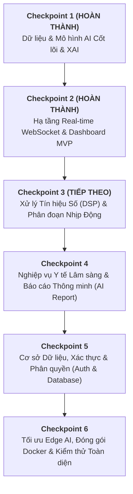

# KẾ HOẠCH PHÁT TRIỂN HỆ THỐNG ECG ARRHYTHMIA DETECTION & EXPLAINABLE AI (XAI)
> **Tài liệu Kế hoạch Chi tiết & Phân bổ Checkpoint Toàn diện**  
> **Dự án**: Giám sát điện tâm đồ (ECG) thời gian thực & Phát hiện rối loạn nhịp tim ứng dụng Học sâu & XAI  
> **Trạng thái Codebase hiện tại**: Đã hoàn tất MVP Core (Data, 5 Models Benchmark, 1D Grad-CAM, FastAPI WebSocket, React Plotly UI V3).

---

## I. TỔNG QUAN HIỆN TRẠNG TOÀN BỘ CÁC NHÁNH (GIT AUDIT)

Dưới đây là tổng hợp rà soát toàn bộ các nhánh trong kho mã nguồn:

| Tên nhánh (Branch) | Trạng thái | Nội dung đã hoàn thành | Đánh giá & Vấn đề tồn đọng |
|:---|:---:|:---|:---|
| `main` | Cũ (Behind) | Đã merge PR #1 → #4 (Data setup, Kaggle CSV, MIT-BIH PhysioNet, SMOTE, Docs cơ bản). | Chưa đồng bộ các nhánh AI, Backend, Frontend mới nhất. Cần merge theo lộ trình. |
| `feat/data` | Hoàn thành | Pipeline nạp MIT-BIH, SMOTE cân bằng dữ liệu 5 lớp AAMI (N, S, V, F, Q), xuất `.npy`. | Cần bổ sung thêm pipeline lọc nhiễu số (DSP) chuyên sâu và dynamic R-peak detection. |
| `feat/ai-model-development` | Hoàn thành | Xây dựng & benchmark 5 mô hình: ResNet1D, CNN-LSTM, TCN, Transformer1D, Mamba1D. ResNet1D đạt Acc 98.57%, Latency 0.13ms. | Model đang nhận đầu vào cố định 187 điểm; cần chuẩn hóa pipeline inference động. |
| `feat/explainable-ai` | Hoàn thành | Tích hợp 1D Grad-CAM vào layer3 của ResNet1D, xuất heatmap trọng số vùng sóng bất thường. | Mới áp dụng cho ResNet1D; cần thêm cơ chế trích xuất đa phương pháp (Integrated Gradients / SHAP). |
| `feat/websocket` / `feat/backend-integration` | Hoàn thành | FastAPI WebSocket server, stream gói tin theo tần số 360Hz (36 FPS x 10 điểm), tích hợp `ai_service`. | Cần tách biệt việc đọc file mô phỏng với luồng tiếp nhận tín hiệu ngoại vi/đa bệnh nhân. |
| `feat/frontend-integration` *(HEAD)* | Đang phát triển | React 19 + Vite, Plotly chart real-time, AnomalyContext, XAIPage tương tác, Dark/Minimalist UI. | Tab Bệnh nhân & Cài đặt đang là placeholder; chưa có Database lưu trữ lịch sử dài hạn. |

---

## II. LỘ TRÌNH VÀ CÁC CHECKPOINT LỚN (MAJOR CHECKPOINTS)

---

## III. CHI TIẾT TỪNG CHECKPOINT VÀ SUB-CHECKPOINTS

---

### 🟢 CHECKPOINT 1: DỮ LIỆU, MÔ HÌNH HỌC SÂU (AI CORE) & EXPLAINABLE AI
> **Trọng tâm**: Xây dựng nền tảng học máy vững chắc, giải quyết triệt để vấn đề mất cân bằng dữ liệu và tính minh bạch của mô hình AI.

#### 1.1. Hiện trạng (Đã có gì)
- Tập dữ liệu MIT-BIH Arrhythmia Database (cả dạng Kaggle CSV và dạng PhysioNet `.dat`/`.hea`/`.atr`).
- Phân loại chuẩn 5 lớp theo hiệp hội AAMI:
  - `0 - N`: Normal beat
  - `1 - S`: Supraventricular ectopic beat
  - `2 - V`: Ventricular ectopic beat (PVC)
  - `3 - F`: Fusion beat
  - `4 - Q`: Unknown beat
- Kỹ thuật SMOTE cân bằng dữ liệu tập train lên 72,471 mẫu/lớp.
- Triển khai 5 kiến trúc mô hình học sâu 1D: `ResNet1D`, `CNN1D_LSTM`, `TCN`, `Transformer1D`, `Mamba1D`.
- Benchmark toàn diện, chọn `ResNet1D` làm mô hình production (F1-score 92.16%, Latency 0.13ms).
- Module `GradCAM1D` giải thích quyết định của ResNet1D tại khối `layer3`.

#### 1.2. Các Checkpoint nhỏ (Sub-checkpoints)
- [x] **CP 1.1 - Data Ingestion & Formatting**: Nạp MIT-BIH dataset, chuẩn hóa định dạng ma trận NumPy 187 mẫu.
- [x] **CP 1.2 - Imbalanced Data Handling**: Áp dụng SMOTE trên tập train, giữ nguyên phân phối tập test thực tế.
- [x] **CP 1.3 - Deep Learning Suite Construction**: Cài đặt 5 kiến trúc mạng nơ-ron (ResNet1D, CNN-LSTM, TCN, Transformer, Mamba).
- [x] **CP 1.4 - Model Benchmarking & Selection**: Đánh giá Accuracy, F1-Score, Inference Latency, Model Size.
- [x] **CP 1.5 - Explainable AI (1D Grad-CAM)**: Trích xuất gradient và activation map, tạo vector heatmap 187 điểm chỉ ra vùng sóng dị dạng.

---

### 🟢 CHECKPOINT 2: HẠ TẦNG WEBSOCKET REAL-TIME & GIAO DIỆN MONITORING MVP
> **Trọng tâm**: Kết nối luồng dữ liệu liên tục từ Backend sang Frontend với độ trễ tối thiểu và trực quan hóa nhịp tim thời gian thực.

#### 2.1. Hiện trạng (Đã có gì)
- Backend FastAPI với kiến trúc module: `backend/api`, `backend/core`, `backend/service`.
- Kênh truyền WebSocket `ws://localhost:8000/ws/ecg` truyền tải mảng 10 điểm tín hiệu / gói tin ở tốc độ 36 FPS (chuẩn 360 Hz của thiết bị y tế).
- Singleton `ECGInferenceService` tải mô hình `ResNet1D` vào bộ nhớ và chỉ kích hoạt Grad-CAM khi phát hiện bất thường để tối ưu tài nguyên.
- Frontend React 19 + Vite sử dụng thư viện `react-plotly.js` vẽ tín hiệu trơn tru.
- Hệ thống tự phục hồi kết nối (Auto-Reconnect 3s) và giao diện Dark/Light mode tối giản chuẩn y tế.
- Trang phân tích `XAIPage` với biểu đồ tương tác kết hợp Bar Heatmap và dải sóng ECG.

#### 2.2. Các Checkpoint nhỏ (Sub-checkpoints)
- [x] **CP 2.1 - FastAPI WebSocket Engine**: Xây dựng router WebSocket, quản lý vòng đời kết nối (lifespan, connect, disconnect).
- [x] **CP 2.2 - Simulated Streamer Service**: Trình phát tín hiệu giả lập đọc từ các file PhysioNet với bộ đệm xoay vòng `deque(maxlen=187)`.
- [x] **CP 2.3 - Real-time Inference Pipeline**: Kết nối dữ liệu bộ đệm với bộ dự đoán AI và đóng gói Payload JSON.
- [x] **CP 2.4 - React Plotly Streaming Dashboard**: Tạo biểu đồ cuộn liên tục (1000 điểm gần nhất), hiển thị BPM, trạng thái nhịp, độ trễ AI.
- [x] **CP 2.5 - Anomaly Context & XAI Inspector**: Lưu trữ các sự kiện bất thường vào React Context và xem chi tiết heatmap từng ca lỗi.

---

### 🟡 CHECKPOINT 3: XỬ LÝ TÍN HIỆU SỐ (DSP) NÂNG CAO & CẮT PHỨC BỘ R-PEAK ĐỘNG
> **Trọng tâm**: Chuyển từ việc cắt cửa sổ tĩnh 187 điểm sang xử lý tín hiệu thực tế: lọc nhiễu y tế (nhiễu thở, nhiễu điện lưới) và tự động nhận diện đỉnh R (Pan-Tompkins Algorithm).

#### 3.1. Phân tích hiện trạng & Hạn chế cần khắc phục
- Hiện tại dữ liệu đang được đọc bằng bộ đệm trượt 187 điểm liên tiếp mà chưa có bước phát hiện đỉnh R thực tế (R-peak alignment). Khi nhịp tim thay đổi tần số (nhịp nhanh, nhịp chậm), cửa sổ tĩnh có thể cắt lệch đỉnh QRS.
- Tín hiệu thực tế từ bệnh nhân luôn có nhiễu đường đẳng điện (Baseline Wander) và nhiễu cơ (Electromyogram - EMG).

#### 3.2. Nội dung cần phát triển
1. **Module Tiền Xử Lý Tín Hiệu Số (Digital Signal Processing - DSP)**:
   - Bộ lọc thông dải Butterworth (Bandpass Filter: 0.5 Hz - 45 Hz) loại bỏ trôi đường đẳng điện và nhiễu tần số cao.
   - Bộ lọc khử nhiễu điện lưới Notch Filter (50 Hz / 60 Hz).
2. **Thuật toán Phát hiện đỉnh R (R-Peak Detection)**:
   - Triển khai thuật toán kinh điển **Pan-Tompkins** (Đạo hàm, Bình phương, Tích phân cửa sổ trượt, Ngưỡng thích nghi).
   - Tự động cắt cửa sổ xung quanh đỉnh R (Ví dụ: -90 mẫu đến +96 mẫu = đúng 187 mẫu, căn chuẩn tâm sóng R).
3. **Tính toán Nhịp tim Tức thời (Instantaneous Heart Rate - BPM) và HRV**:
   - Tính khoảng cách R-R interval ($RR = t_{R_i} - t_{R_{i-1}}$).
   - Trích xuất các chỉ số biến thiên nhịp tim cơ bản: SDNN, RMSSD (chỉ báo sớm suy tim/loạn nhịp).
4. **Bộ chọn Nguồn Tín hiệu Đa dạng (Data Source Selector)**:
   - Cho phép chọn stream từ các ca bệnh khác nhau trong MIT-BIH (Record 100 - Bình thường, Record 208 - PVC nặng, Record 207 - Rung thất/Cuồng nhĩ, Record 213 - PAC).
   - Endpoint upload file ECG từ máy tính (.csv, .dat, .edf) để chạy chẩn đoán Offline/Batch.

#### 3.3. Các Checkpoint nhỏ (Sub-checkpoints)
- [ ] **CP 3.1 - DSP Preprocessing Module** (`backend/core/signal_processing.py`):
  - Cài đặt hàm `bandpass_filter(signal, lowcut=0.5, highcut=45.0, fs=360)`.
  - Cài đặt hàm `notch_filter(signal, cutoff=50.0, q=30.0, fs=360)`.
- [ ] **CP 3.2 - Dynamic R-Peak Detector** (`backend/core/qrs_detector.py`):
  - Cài đặt Pan-Tompkins QRS detector hoặc tích hợp `scipy.signal.find_peaks` kết hợp adaptive threshold.
  - Hàm `extract_beat_window(signal, r_peak_idx, window_size=187)`.
- [ ] **CP 3.3 - HRV & Exact BPM Calculation Engine**:
  - Tính toán BPM tức thời dựa trên khoảng cách RR thực tế thay vì giá trị cố định.
  - Cung cấp chỉ số HRV (SDNN) phục vụ cảnh báo nguy cơ rối loạn hệ thần kinh tim.
- [ ] **CP 3.4 - Patient Record Switcher API**:
  - REST endpoint `GET /api/records` lấy danh sách hồ sơ mẫu.
  - WebSocket command hoặc endpoint `POST /api/stream/switch-record` chuyển đổi bản ghi đang phát trực tiếp.
- [ ] **CP 3.5 - File Upload & Offline Diagnosis API**:
  - `POST /api/diagnosis/upload-ecg` nhận file tín hiệu, tiền xử lý, chạy inference toàn bộ và trả về báo cáo tổng hợp.

---

### 🟡 CHECKPOINT 4: NGHIỆP VỤ Y TẾ LÂM SÀNG, BÁO CÁO THÔNG MINH (AI REPORT) & HỆ THỐNG CẢNH BÁO
> **Trọng tâm**: Nâng cấp giao diện người dùng thành phần mềm trạm điều dưỡng/bác sĩ thực thụ với đầy đủ công cụ theo dõi, cảnh báo đa giác quan và giải trình AI lâm sàng.

#### 4.1. Phân tích hiện trạng & Hạn chế cần khắc phục
- Tab "Hồ sơ bệnh nhân" và "Cài đặt" trên giao diện hiện tại mới chỉ là trang giữ chỗ.
- Cảnh báo mới chỉ hiển thị dạng chữ và highlight biểu đồ, chưa có chuông âm thanh hay thông báo khẩn cấp khi gặp loạn nhịp nguy hiểm tính mạng (như Rung thất - Ventricular Fibrillation).
- Chưa có tính năng xuất bệnh án điện tử (PDF/CSV Export) để bàn giao ca trực.

#### 4.2. Nội dung cần phát triển
1. **Module Quản lý Hồ sơ Bệnh nhân (Patient Management Dashboard)**:
   - Danh sách bệnh nhân đang theo dõi tại khoa Tim mạch (Tên, Tuổi, Giới tính, Tiền sử bệnh, Giường bệnh, Bác sĩ phụ trách).
   - Giao diện chuyển đổi nhanh giữa các giường bệnh (Multi-bed Monitoring View).
2. **Hệ thống Cảnh báo Đa Tầng (Multi-Tier Alarm System)**:
   - Phân cấp mức độ nguy hiểm:
     - 🟢 **Mức 1 (Bình thường)**: Nhịp xoang đều.
     - 🟡 **Mức 2 (Chú ý)**: Ngoại tâm thu nhĩ (PAC), nhịp nhanh xoang nhẹ.
     - 🔴 **Mức 3 (Khẩn cấp)**: Ngoại tâm thu thất đa ổ (PVC), Cơn tim nhanh thất (VT), Rung thất.
   - Hiệu ứng âm thanh cảnh báo (Audio Beep) có thể Bật/Tắt/Tắt tạm thời (Mute 2 phút chuẩn y tế).
   - Visual flashing và thông báo đẩy (Browser Push Notification).
3. **Trợ lý AI Tạo Báo Cáo Lâm Sàng (LLM Medical Summary Integration)**:
   - Tổng hợp dữ liệu đoạn sóng bất thường + kết quả Grad-CAM → Tự động tạo tóm tắt chẩn đoán bằng ngôn ngữ y khoa tự nhiên (VD: *"Phát hiện ngoại tâm thu thất dạng chùm tại giây thứ 45, sóng QRS biến dạng dãn rộng 140ms, đề xuất kiểm tra điện giải và theo dõi Holter"*).
4. **Xuất Báo Cáo Y Tế (Medical Report Exporter)**:
   - Xuất file PDF Bệnh án điện tử chuẩn form bệnh viện gồm: Thông tin bệnh nhân, Đồ thị ECG in lưới 25mm/s, Đồ thị XAI Grad-CAM, Bảng thống kê số lần xuất hiện từng dạng nhịp trong ca trực.
   - Xuất dữ liệu thô dạng CSV để phục vụ nghiên cứu khoa học.

#### 4.3. Các Checkpoint nhỏ (Sub-checkpoints)
- [ ] **CP 4.1 - Patient Management UI & Form Validation** (`frontend/src/pages/PatientPage.jsx`):
  - Giao diện CRUD thông tin bệnh nhân, chỉ định giường bệnh, thông số sinh tồn nền (Huyết áp, SpO2).
- [ ] **CP 4.2 - Medical Audio & Visual Alarm System**:
  - Tích hợp Web Audio API phát âm thanh cảnh báo chuẩn IEC 60601-1-8 cho thiết bị y tế.
  - Bộ điều khiển Mute Alarm / Snooze Alarm trên Header.
- [ ] **CP 4.3 - Automated Medical Report Generator (PDF/CSV)**:
  - Sử dụng thư viện `jspdf` và `html2canvas` tại frontend hoặc `ReportLab` tại backend.
  - Vẽ lưới đồ thị điện tim chuẩn y khoa (chuẩn 1mm = 0.04s, 5mm = 0.2s) kèm chữ ký số bác sĩ.
- [ ] **CP 4.4 - AI Diagnostic Explainer (Contextual XAI)**:
  - Hiển thị bảng phân tích chi tiết: Thời lượng đoạn sóng PR, khoảng QRS, đoạn ST, giải thích trực quan tại sao AI đánh dấu nghi ngờ.
- [ ] **CP 4.5 - Settings & Calibration Page** (`frontend/src/pages/SettingsPage.jsx`):
  - Cấu hình ngưỡng nhạy AI (Sensitivity/Specificity Threshold), tùy chỉnh địa chỉ WebSocket server, cấu hình dark/light mode tự động.

---

### 🟡 CHECKPOINT 5: HỆ THỐNG CƠ SỞ DỮ LIỆU, XÁC THỰC BẢO MẬT & PHÂN QUYỀN (RBAC)
> **Trọng tâm**: Chuyển đổi ứng dụng từ dạng Demo bộ nhớ tạm (In-Memory / LocalStorage) sang Hệ thống Y tế Doanh nghiệp (Enterprise Healthcare System) có cơ sở dữ liệu bền vững và bảo mật tiêu chuẩn.

#### 5.1. Phân tích hiện trạng & Hạn chế cần khắc phục
- Hiện tại mọi sự kiện bất thường chỉ được lưu tạm trên `AnomalyContext` của React (tối đa trong phiên làm việc, F5 là mất nếu không có DB).
- Chưa có cơ chế đăng nhập, ai truy cập cũng có quyền xem và cấu hình.
- Thiếu cơ chế ghi nhật ký kiểm toán (Audit Trail) - yếu tố bắt buộc của phần mềm y tế (chuẩn HIPAA/HL7).

#### 5.2. Nội dung cần phát triển
1. **Cơ sở Dữ liệu Quan hệ & Chuỗi Thời gian (Database Architecture)**:
   - **PostgreSQL / SQLite** (cho giai đoạn dev): Lưu trữ User, Bệnh nhân, Lịch sử Ca bệnh, Cấu hình thiết bị.
   - Bảng `ecg_records` & `anomaly_events`: Lưu trữ dấu vết từng nhịp lỗi, nhãn dự đoán, độ tin cậy (confidence), heatmap array, timestamp chính xác đến mili-giây.
2. **Hệ thống Xác thực (Authentication) & Phân quyền (RBAC)**:
   - Đăng nhập JWT (JSON Web Token), mã hóa mật khẩu bằng bcrypt.
   - Các vai trò (Roles):
     - `Admin`: Quản lý người dùng, cấu hình server, xem log hệ thống.
     - `Doctor (Bác sĩ)`: Xem stream thời gian thực, xem XAI, xác nhận/sửa nhãn chẩn đoán của AI (Human-in-the-loop), xuất báo cáo y tế.
     - `Nurse (Điều dưỡng)`: Giám sát tín hiệu, tiếp nhận và tắt chuông cảnh báo, cập nhật thông tin bệnh nhân.
3. **Cơ chế Human-in-the-Loop (Bác sĩ xác nhận kết quả AI)**:
   - Cho phép Bác sĩ bấm nút: "Đồng ý với AI" hoặc "Sửa thành [Nhịp khác]".
   - Lưu trữ dữ liệu được Bác sĩ sửa làm tập dữ liệu Active Learning để tái huấn luyện (Retrain) mô hình trong tương lai.
4. **Nhật ký Kiểm toán (Audit Logs)**:
   - Ghi lại ai đã xem bệnh án nào, ai đã tắt chuông cảnh báo lúc mấy giờ, ai đã chỉnh sửa thông tin.

#### 5.3. Các Checkpoint nhỏ (Sub-checkpoints)
- [ ] **CP 5.1 - Database Schema & SQLAlchemy ORM** (`backend/db/`):
  - Thiết kế các bảng: `users`, `patients`, `records`, `anomaly_logs`, `audit_trails`.
  - Thiết lập Alembic migration quản lý phiên bản database.
- [ ] **CP 5.2 - Authentication & Authorization APIs** (`backend/api/auth.py`):
  - Endpoints: `POST /api/auth/login`, `POST /api/auth/refresh`, `GET /api/auth/me`.
  - Middleware kiểm tra JWT token và phân quyền RBAC cho từng endpoint.
- [ ] **CP 5.3 - Historical Anomaly Query & Pagination APIs** (`backend/api/anomalies.py`):
  - `GET /api/anomalies?patient_id=...&from=...&to=...&page=1`
  - Lọc sự kiện theo dạng bất thường (chỉ xem PVC hoặc chỉ xem PAC).
- [ ] **CP 5.4 - Doctor Feedback & Human-in-the-Loop API**:
  - `POST /api/anomalies/{id}/verify` (Lưu xác nhận của bác sĩ: Approved / Corrected).
- [ ] **CP 5.5 - Frontend Auth Guard & Role-based UI**:
  - Màn hình Đăng nhập (Login Page), quản lý token qua HTTP-only Cookie / Secure Storage.
  - Ẩn/Hiện tính năng tùy theo vai trò người dùng đăng nhập.

---

### 🟡 CHECKPOINT 6: TỐI ƯU EDGE AI, ĐÓNG GÓI DOCKER, CI/CD & KIỂM THỬ TOÀN DIỆN
> **Trọng tâm**: Tối ưu hóa hiệu năng mô hình cho thiết bị biên (Edge Device), đóng gói toàn bộ hệ sinh thái thành các container Docker và tự động hóa kiểm thử.

#### 6.1. Nội dung cần phát triển
1. **Tối ưu hóa Mô hình (Model Optimization & Edge Acceleration)**:
   - Chuyển đổi mô hình PyTorch `resnet1d.pth` sang định dạng **ONNX (Open Neural Network Exchange)** và **TensorRT / OpenVINO**.
   - Thực hiện lượng hóa mô hình (INT8 / FP16 Quantization) giúp giảm kích thước mô hình từ 2.7MB xuống < 700KB, tăng tốc độ xử lý gấp 3-5 lần trên CPU/Edge IoT (Raspberry Pi, Jetson Nano).
2. **Container Hóa với Docker & Docker Compose**:
   - `Dockerfile.backend`: Python slim, cài đặt thư viện cần thiết, chạy uvicorn đa worker.
   - `Dockerfile.frontend`: Multi-stage build với Node.js và serve bằng Nginx reverse proxy siêu nhẹ.
   - `docker-compose.yml`: Khởi chạy đồng thời Backend, Frontend, Database PostgreSQL chỉ với 1 lệnh `docker compose up -d`.
3. **Bộ Kiểm Thử Tự Động Toàn Diện (Testing Suite)**:
   - **Unit Tests** (Pytest): Kiểm thử các hàm DSP lọc nhiễu, Pan-Tompkins, các lớp mạng ResNet1D, hàm tính Grad-CAM.
   - **WebSocket Integration Tests**: Kiểm thử khả năng chịu tải của WebSocket, mô phỏng 50-100 kết nối đồng thời mà không bị rớt gói tin.
   - **Frontend Tests**: Unit test các component React với Vitest/React Testing Library.
4. **CI/CD Pipeline (GitHub Actions)**:
   - Tự động chạy linter (oxlint, flake8), chạy test suite khi push code hoặc tạo Pull Request.
   - Tự động build Docker Image và kiểm tra lỗ hổng bảo mật.

#### 6.2. Các Checkpoint nhỏ (Sub-checkpoints)
- [ ] **CP 6.1 - PyTorch to ONNX & Quantization Pipeline** (`src/models/export_onnx.py`):
  - Chuyển đổi mô hình ResNet1D sang `resnet1d.onnx` và kiểm chứng sai số đầu ra ($< 10^{-5}$).
  - Cài đặt backend inference bằng `onnxruntime`.
- [ ] **CP 6.2 - Automated Test Suite**:
  - `tests/test_dsp.py`: Kiểm thử bộ lọc tín hiệu.
  - `tests/test_model.py`: Kiểm thử kích thước tensor và độ chính xác suy luận.
  - `tests/test_websocket.py`: Kiểm thử kết nối WebSocket và payload schema.
- [ ] **CP 6.3 - Dockerization**:
  - Viết `backend.Dockerfile`, `frontend.Dockerfile`, `nginx.conf`, và `docker-compose.yml`.
- [ ] **CP 6.4 - CI/CD GitHub Actions Workflow**:
  - Tạo file `.github/workflows/ci-cd.yml` tự động kiểm tra code quality, chạy pytest và build frontend.
- [ ] **CP 6.5 - Hoàn thiện Tài liệu Kỹ thuật & Báo cáo Nghiệm thu Tổng kết**:
  - Cập nhật `README.md` chính, `docs/api_reference.md`, `docs/deployment_guide.md`.
  - Hướng dẫn demo trực quan cho buổi bảo vệ đồ án / nghiệm thu dự án.

---

## IV. BẢNG TỔNG HỢP TIẾN ĐỘ VÀ KẾ HOẠCH PHÂN BỔ THỜI GIAN DỰ KIẾN

| Checkpoint | Hạng mục công việc | Trạng thái | Ưu tiên | Độ phức tạp |
|:---|:---|:---:|:---:|:---:|
| **CP 1** | Tiền xử lý dữ liệu MIT-BIH, SMOTE, Huấn luyện 5 Models, Benchmark, 1D Grad-CAM | ✅ **100% Hoàn thành** | Cao | Cao |
| **CP 2** | FastAPI WebSocket Server, Singleton Inference, React Plotly Dashboard, XAI Page | ✅ **100% Hoàn thành** | Cao | Trung bình |
| **CP 3** | DSP Lọc nhiễu, Pan-Tompkins R-peak, Tính BPM/HRV chính xác, Bộ chọn bản ghi bệnh nhân | ⏳ **Kế tiếp (Sprint 1)** | Rất Cao | Trung bình |
| **CP 4** | Quản lý Hồ sơ Bệnh nhân, Hệ thống Chuông Cảnh báo Y tế, Xuất Bệnh án PDF/CSV, Cài đặt | ⏳ **Sprint 2** | Cao | Trung bình |
| **CP 5** | Database PostgreSQL/SQLite, Xác thực JWT, Phân quyền RBAC Bác sĩ/Điều dưỡng, Audit Log | ⏳ **Sprint 3** | Trung bình | Cao |
| **CP 6** | Tối ưu ONNX INT8, Đóng gói Docker Compose, Kiểm thử tự động Pytest, CI/CD Pipeline | ⏳ **Sprint 4** | Trung bình | Cao |

---

## V. ĐỀ XUẤT CÁC BƯỚC HÀNH ĐỘNG TIẾP THEO (NEXT STEPS)

1. **Đồng bộ hóa Git**:
   - Tạo Pull Request merge nhánh `feat/frontend-integration` vào `main` để đưa mã nguồn ổn định nhất về nhánh chính.
2. **Bắt đầu thực thi Checkpoint 3**:
   - Tạo nhánh mới `feat/dsp-and-beat-segmentation` từ `main`.
   - Xây dựng module `backend/core/signal_processing.py` để xử lý lọc nhiễu thực thụ và tích hợp thuật toán phát hiện đỉnh R.
3. **Phát triển Checkpoint 4**:
   - Hoàn thiện UI trang Quản lý Bệnh nhân và tích hợp chuông cảnh báo âm thanh y tế.
